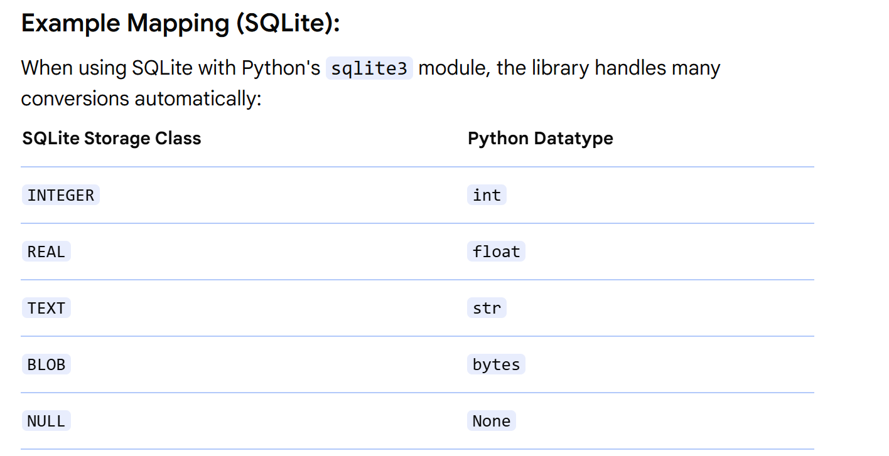

### python sql datatypes mapping guidelines

    When working with SQL databases in Python, understanding how Python data types map to SQL
    data types is crucial for correct data storage and retrieval.

    While specific mappings can vary slightly between different SQL databases
    (e.g., SQLite, PostgreSQL, MySQL, SQL Server), a general correspondence exists.

### Here's a breakdown of common Python data types and their typical SQL counterparts:

#### 1. Numeric Types:

        Python int: Maps to SQL INTEGER, INT, BIGINT, SMALLINT, 
        TINYINT (depending on the required range).
        Python float: Maps to SQL REAL, FLOAT, DOUBLE PRECISION.
        Python decimal.Decimal: Maps to SQL DECIMAL or NUMERIC for precise decimal values, 
        often used in financial applications.

#### 2. String and Text Types:

        Python str: Maps to SQL VARCHAR, TEXT, CHAR, NVARCHAR, NTEXT. 
        The choice depends on fixed vs. variable length, and whether Unicode support is required.

#### 3. Date and Time Types:

        Python datetime.date: Maps to SQL DATE.
        Python datetime.time: Maps to SQL TIME.
        Python datetime.datetime: Maps to SQL DATETIME, TIMESTAMP.

#### 4. Boolean Types:

        Python bool: Maps to SQL BOOLEAN (if supported) or often BIT(1) or TINYINT(1) 
        where 0 represents False and 1 represents True.

#### 5. Binary Types:

        Python bytes or bytearray: Maps to SQL BLOB, BINARY, VARBINARY for storing raw binary data 
        like images or files.

#### 6. Other Types:

        Python None: Maps to SQL NULL.

#### Example Mapping (SQLite):

        When using SQLite with Python's sqlite3 module, the library handles 
        many conversions automatically: SQLite Storage Class
        Python Datatype

### Considerations:

### Precision:

    Be mindful of potential precision loss when mapping Python float to SQL floating-point types. 
    Use decimal.Decimal for critical financial or scientific calculations.

#### Length Constraints:

    When using CHAR or VARCHAR, ensure the specified length in SQL is sufficient 
    for the Python strings being stored.

#### Database-Specific Types:

    Some databases offer specialized data types (e.g., JSON, UUID, MONEY). 
    Consult the documentation for your specific SQL database to understand how these might map to 
    Python types or require custom handling.